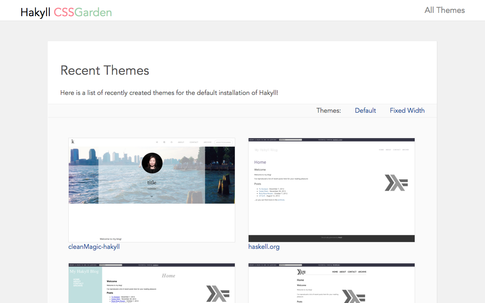

## hakyll-cssgarden

Description: This collection of styles aims to help haskell bloggers set up beautiful blogs with Hakyll static site generator by showcasing available themes.

Auhor: Katherine Chuang @katychuang

## Installation & Setup

To preview the themes, you can follow these steps

1. Install hakyll `cabal install hakyll` or with nix `nix-shell -p '(haskellPackages.ghcWithPackages (pkgs: with pkgs; [ hakyll ]))'`
2. clone this repo
3. cd into `default_theme`
4. compile `ghc --make site.hs`
4. run server with `./site watch` 

## Want to submit themes?

* fork the site on github
* if you have a custom site.hs or template files and assets, create a new directory.
* if you're using the out of the box site.hs and template files: add the file to the css directory under `default_theme` and add an option to the dropdown menu in default.html
* test it out, then push your changes up and open a pull request

